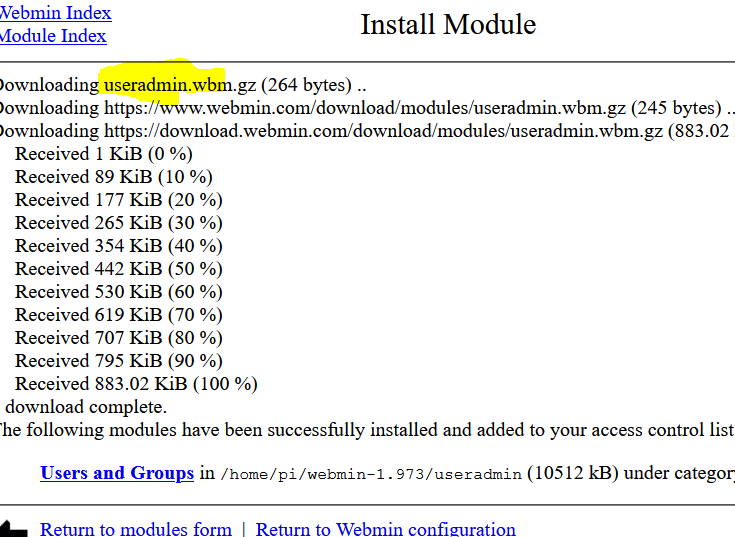
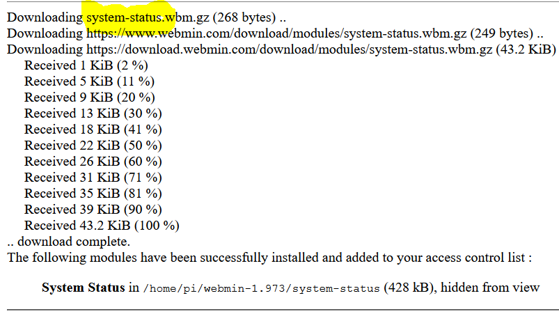
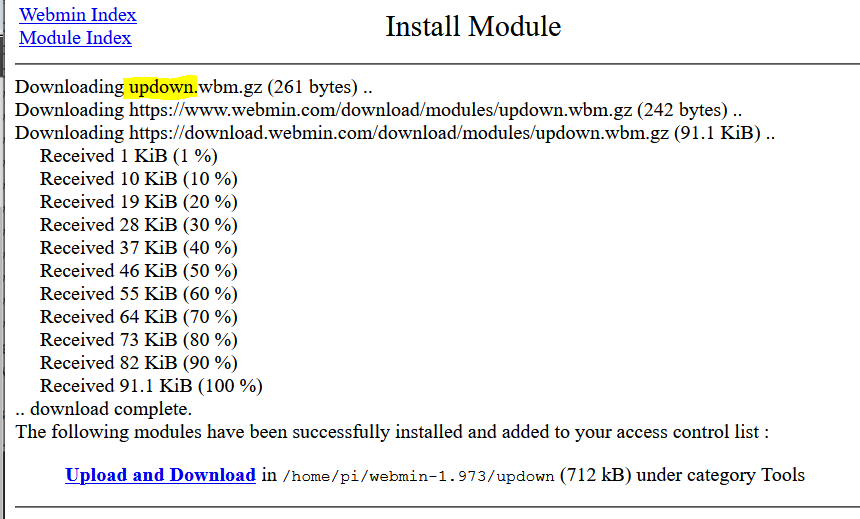
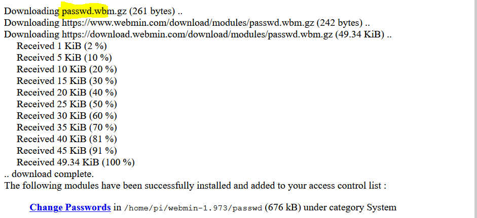

*Installationsanleitung*
---
*Download Module*

 

Hier habe ich das Modul useradmin heruntergeladen. 

Unter System > User and Group kann man Benutzer hinzufügen und bearbeiten.

 

Hier habe ich das Modul system-status heruntergeladen.

 

Hier habe ich das Modul passwd heruntergeladen.

 

